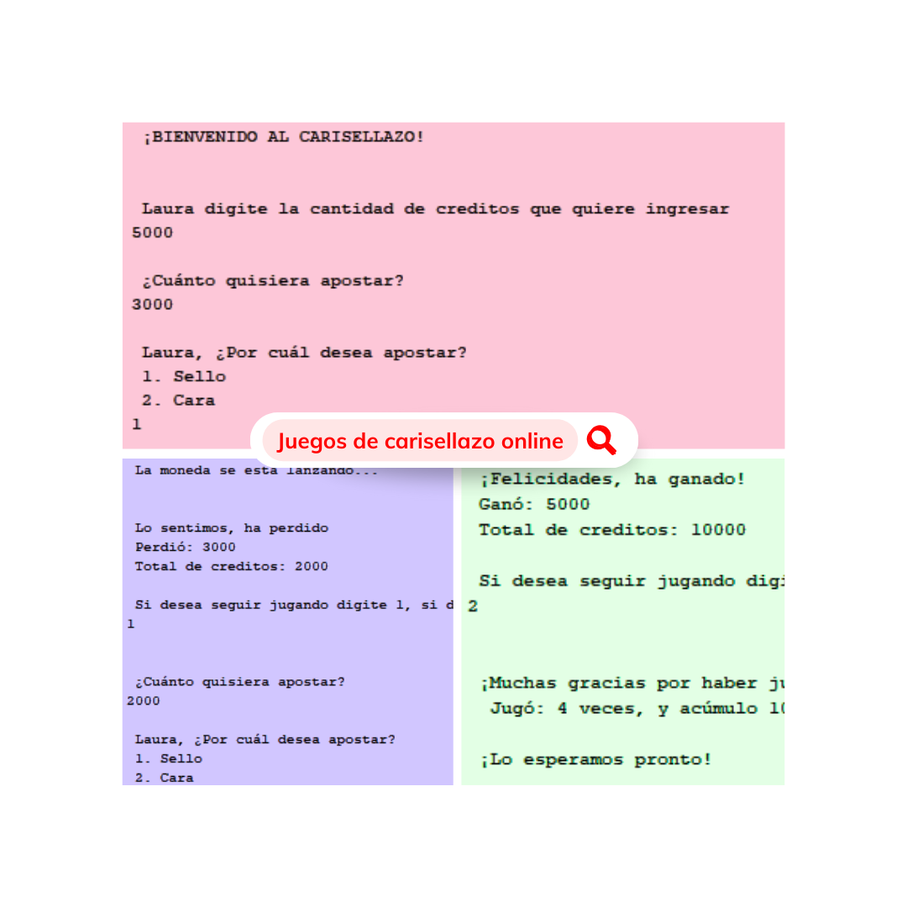

<h1 align="center"> Carisellazo </h1>

 

## Construido con 🛠️

_Herramientas Utilizadas_

* [Java](https://www.java.com/es/)

## Autores ✒️

* **Laura Romero** - Diseñadora FrontEnd y Analista de Bases de Datos - [LauraRomero](https://github.com/LauraRomero2704)
